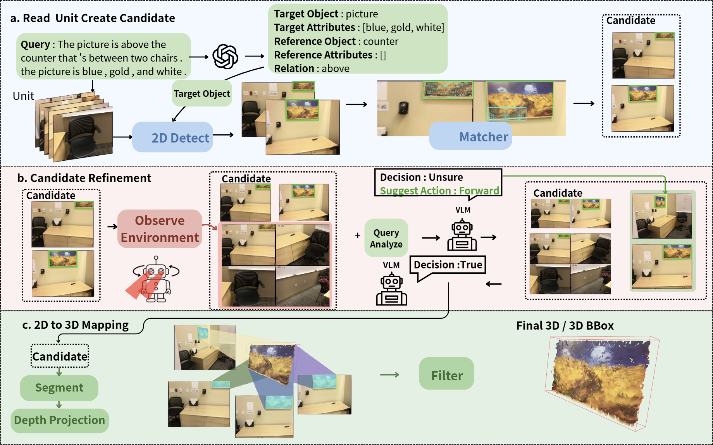

<div align="center">

# PROVE-3D: Progressive Observation and Verification with Evidence for Zero-Shot 3D Visual Grounding

**Wei-Wei Lo, Min-Fang Chuang, An-Yi Lee, and Chow-Sing Lin<sup>*</sup>**

<p align="center">
  <a href="./assets/PROVE_3D.pdf">
    
  </a>
</p>

</div>

<p align="center">
  
</p>

<p align="center">
PROVE-3D is a zero-shot 3D visual grounding framework that progressively
observes a scene, collects multi-view evidence, and verifies candidate objects
before producing a 3D prediction.
</p>

---

## Installation

1. **Clone the repository and its PATS submodule:**

   ```bash
   git clone --recurse-submodules https://github.com/Min-FangChuang/PROVE-3D.git
   cd PROVE-3D
   ```

   If the repository was cloned without submodules:

   ```bash
   git submodule update --init --recursive
   ```

2. **Create and activate the environment:**

   ```bash
   conda create -n prove3d python=3.11
   conda activate prove3d
   ```

3. **Install the dependencies:**

   ```bash
   python -m pip install -r requirements.txt
   python -m pip install --no-build-isolation ./pats/setup
   ```

The current PATS implementation uses CUDA-specific operations. A Linux system
with an NVIDIA GPU is recommended.

---

## Quick Start

### 1. Data Preparation

#### ScanNet multi-view data

Access to ScanNet requires accepting the
[ScanNet Terms of Use](https://github.com/ScanNet/ScanNet#scannet-data).
The required download and extraction scripts are included in `scannet/`.

```bash
cd scannet
python download.py
python extract_posed_image.py
cd ..
```

The scripts read `scannet/scannetv2_val.txt` and produce:

```text
scannet/
├── alignment/
│   └── sceneXXXX_XX/
│       └── sceneXXXX_XX.txt
└── posed_images/
    └── sceneXXXX_XX/
        ├── intrinsic.txt
        ├── 00000.jpg
        ├── 00000.png
        ├── 00000.txt
        └── ...
```

#### ScanNet point clouds and instance labels

Download and extract the preprocessed `referit3d.tar.gz` data from the
[vil3dref repository](https://github.com/cshizhe/vil3dref). Copy the following
two directories into `./benchmark/`:

```bash
cp -R /path/to/referit3d/scan_data/pcd_with_global_alignment \
  ./benchmark/
cp -R /path/to/referit3d/scan_data/instance_id_to_name \
  ./benchmark/
```

The final benchmark layout should be:

```text
benchmark/
├── pcd_with_global_alignment/
│   └── sceneXXXX_XX.pth
├── instance_id_to_name/
│   └── sceneXXXX_XX.json
├── scanrefer_250_with_query_analysis.json
└── nr3d_250_with_query_analysis.json
```

The ScanRefer and Nr3D benchmark JSON files are already included in this
repository.

### 2. Model Weights

#### PATS

Download the pretrained indoor weights from the
[PATS repository](https://github.com/zju3dv/pats#download-link) and place them
under `pats/weights/`:

```text
pats/weights/
├── indoor_coarse.pth
├── indoor_fine.pth
└── indoor_third.pth
```

#### SAM-Huge

Download the
[SAM-Huge checkpoint](https://dl.fbaipublicfiles.com/segment_anything/sam_vit_h_4b8939.pth)
and place it under `checkpoints/SAM/`:

```bash
mkdir -p checkpoints/SAM
curl -L \
  https://dl.fbaipublicfiles.com/segment_anything/sam_vit_h_4b8939.pth \
  -o checkpoints/SAM/sam_vit_h_4b8939.pth
```

The YOLOE checkpoint used by the evaluation commands is
`yoloe-11l-seg.pt`. Ultralytics downloads it automatically on first use.

### 3. API Configuration

Set the following values in `vlm_api_bridge.py`:

```python
OPENAI_API_KEY = "YOUR_API_KEY"
OPENAI_MODEL = "YOUR_MODEL_NAME"
```

Do not commit your API key to a public repository.

### 4. Evaluation

PROVE-3D supports two evaluation strategies: **Full Scene** and **Early
Stop**. The examples below evaluate the ScanRefer benchmark.

#### Full Scene

The Full Scene strategy processes the complete scene before selecting the
final candidate.

```bash
python -u eval_read_test_multiselect_nonfalse.py \
  --max-cases 250 \
  --sam-device cuda \
  --detector-model yoloe-11l-seg.pt \
  --data-path ./benchmark/scanrefer_250_with_query_analysis.json \
  --eval-mode scanrefer \
  2>&1 | tee output.log
```

#### Early Stop

The Early Stop strategy terminates observation once sufficient evidence has
been collected to verify a candidate.

```bash
python -u eval_read_test.py \
  --max-cases 250 \
  --sam-device cuda \
  --detector-model yoloe-11l-seg.pt \
  --data-path ./benchmark/scanrefer_250_with_query_analysis.json \
  --eval-mode scanrefer \
  2>&1 | tee output.log
```

To evaluate Nr3D with either strategy, use:

```text
--data-path ./benchmark/nr3d_250_with_query_analysis.json --eval-mode nr3d
```

Use `--max-cases 1` for a one-case test, or `--case-index N` to run one
specific zero-based case. Rename the `tee` output file when running both
strategies to avoid overwriting the first log.

---

## Preprocessing from Scratch

### ScanNet posed images

To generate the posed ScanNet RGB, depth, camera-pose, and intrinsic files,
run the preprocessing scripts in this order:

1. `scannet/download.py`
2. `scannet/extract_posed_image.py`

```bash
cd scannet
python download.py
python extract_posed_image.py
cd ..
```

### Query analysis

The repository already includes the preprocessed benchmark JSON files. To
regenerate them after changing the source data or query-analysis prompt, first
configure the API settings in `vlm_api_bridge.py`, then run:

```bash
python preprocess_query_analysis.py \
  --input ./benchmark/scanrefer_250.json \
  --output ./benchmark/scanrefer_250_with_query_analysis.json

python preprocess_query_analysis.py \
  --input ./benchmark/nr3d_250.json \
  --output ./benchmark/nr3d_250_with_query_analysis.json
```

---

## Acknowledgements

This project builds upon the following projects and datasets:

- [SeqVLM](https://github.com/JiawLin/SeqVLM)
- [PATS](https://github.com/zju3dv/pats)
- [ScanNet](https://github.com/ScanNet/ScanNet)
- [vil3dref](https://github.com/cshizhe/vil3dref)
- [Segment Anything](https://github.com/facebookresearch/segment-anything)
- [Ultralytics](https://github.com/ultralytics/ultralytics)
